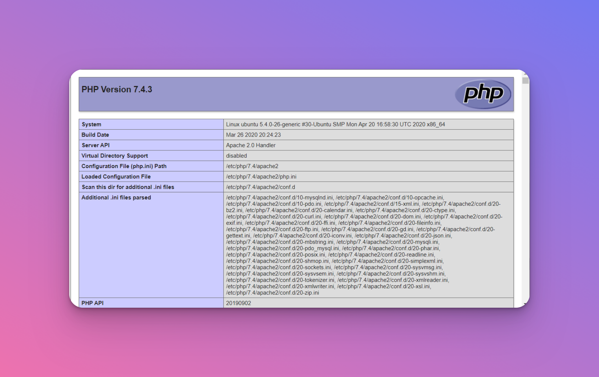

<span style="font-family:Merriweather;">

# Step by step instructions for setting up a LAMP suite webshop

## 1.✨ Getting started

`Web shop` is a web-based application that allows businesses to sell products and services online. It can be used to create an online store, or to add e-commerce functionality to an existing website.

`Web shop` is written in PHP and uses a MySQL database to store information about products, customers, orders, and so on. It is designed to be easy to use, even for people who are not familiar with web development.

In order to install `Web shop`, you will need to have a LAMP (Linux, Apache, MySQL, PHP) stack server installed on Ubuntu 22.04. 
## 2. 📝Prerequisites
The minimal system resources to setup LAMP server and `Web shop` depends upon the requirements. We are going to setup the LAMP Server under the following base system with minimal installation.


    1. Operating system: Ubuntu 22.04
    2. CPU: Intel i9 Processor
    3. Memory (RAM): 32GB
    4. Disk Space: 2TB

A system with Ubuntu 22.04 installed is required for our setup, we will now proceed on setting up LAMP by installing Apache (web server), MySQL (database server) then PHP in the following order.

## 3.🏗️ Setup LAMP stack
1. **System update**
   - Make sure your system is up to date before starting the setup. You can also do this using: `$ sudo apt update`

2. **Install Apache** 
   - The next step is to install Apache. You can do this by running the following command: `$ sudo apt install apache2`

3. **Install MySQL** 
   - The next step is to install MySQL. You can also do this by running the following command: `$ sudo apt install mysql-server`

4. **Install PHP** 
   - The next step is to install PHP. You can do this by running the following command: `$ sudo apt install php libapache2-mod-php php-mysql`

5. **Install phpMyAdmin:** 
   - The next step is to install phpMyAdmin. You can do this by running the following command: `$ sudo apt install phpmyadmin`
  
   - After installing phpMyAdmin, you will need to configure it. You can do this by running the following command: `$ sudo nano /etc/apache2/conf-available/phpmyadmin.conf`

6. **Restart Apache:** 
   - After configuring phpMyAdmin, you will need to restart Apache. You can do this by running the following command: `$ sudo systemctl restart apache2`

7.  **Test your setup**
    - The final step is to test your installation. This can be done by creating a test PHP file, You can do this by running the following command: `$ sudo nano /var/www/html/test.php` 
    - Then add the following code: `<?php phpinfo(); ?>` 
        >
   
  
          Now, open a web browser and type in the following URL: http://SERVER-IP/test.php

          You should see a page that displays information about your PHP installation.

          
         
         
🎉 Congratulations! You have now successfully installed and configured LAMP stack on your system. 🎉 
## 4.🛠️ Configure webshop 
1. Go to the ZIP file `webshop.zip` delivered to your email at `customer@demo.io` 
2. Extract the contents of the ZIP file including the file `setup.sh` to your current working directory.
3. Now move all the contents from your current working directory to the web shop directory: `/opt/myshop` 
4. Enter the following command to change the ownership of the files: `sudo chown -R myshop:myshop /opt/myshop` 
5. Use the following command to change the permissions of the files: `sudo chmod -R 755 /opt/myshop`
6. You should now be able to access the files in `/opt/myshop` directory.
7. Go to the web shop directory using `cd` command 
8. Run setup.sh script using the command: `./setup.sh` to set up the database and web root directory.
   - This script will setup a database for e-shop
   - Then sets the web root directory as `/opt/myshop` 
9. After the shell script setup.sh has been executed, go to the /opt/myshop/ directory and create a file named .htaccess with the following content:
   > 
    ```
    <IfModule mod_rewrite.c>
      RewriteEngine On
      RewriteCond %{REQUEST_FILENAME} !-f
      RewriteCond %{REQUEST_FILENAME} !-d
      RewriteRule ^(.*)$ index.php?/$1 [L]
    </IfModule>

    <IfModule !mod_rewrite.c>
      ErrorDocument 404 index.php
    </IfModule>
    ``` 
10. Then go to `/opt/myshop/application/config/config.php` file and change the configuration for `base_url` to `http://SERVER-IP/myshop/` 
11. Open a web browser and access the `Web shop` by typing in the URL: `http://SERVER-IP/myshop/`
       - You can access the admin panel in the browser using the url `http://SERVER-IP/myshop/admin/`
       - Database can be accessed with the user root that has no password. 

## 5. 💻 Access webshop using HTTPS
1. First, make sure that the shell script setup.sh installation is successfull and web shop is accessible from the browser. 
2. Next, open a terminal window and change to the directory where the script is located. 
3. Install the Let’s Encrypt client by typing the following command: 
`sudo add-apt-repository ppa:certbot/certbot`
`sudo apt-get update`
`sudo apt-get install python-certbot-apache`
4. Obtain an SSL certificate for your domain by typing the following command:
`sudo certbot --apache -d YOUR-SERVER-IP`
5. Follow the instructions on screen to complete the SSL certificate request process.
6. Once the process is complete, your domain should now be accessible via HTTPS.

Once it is finished, you can access the `Web shop` by going to https://SERVER-IP/myshop/

🎉 Congrats! your `Web shop` 🛍️ is setup and ready 🎉

## 6. 📘 Maintenance instructions to keep LAMP stack eshop system running
### 6.1 📋 General Instructions:
1. Backup your files and your database regularly. 
2. Keep your software up to date. 
3. Test your backups regularly. 
4. Monitor your server resources and performance. 
5. Secure your site with SSL/TLS encryption. 
6. Use a Web Application Firewall (WAF) to protect your site.
7. Check the system's CPU usage and memory usage regularly. If the usage is too high, take measures to reduce it. 
8. Check the system's disk usage regularly. If the usage is too high, take measures to reduce it. 
9. Check the system's network usage regularly. If the usage is too high, take measures to reduce it. 
10. Keep the system's software up to date. This includes the operating system, the web server, the database server, and the PHP interpreter. 5. Check the system's logs regularly. This includes the Apache error log, the MySQL error log, and the PHP error log. 
11. Take regular backups of the system. This includes the website files, the database, and the user data.

### 6.2. 🔁 Log Rotation:
1. Decide when and how often to rotate your logs. This will depend on how often your logs are written to and how much disk space you have available. 
2. Choose a log rotation utility. There are many options available, such as logrotate (https://linux.die.net/man/8/logrotate), rotatelogs (http://httpd.apache.org/docs/2.2/programs/rotatelogs.html), or cronolog (http://cronolog.org/). 
3. Configure your chosen utility. This will involve specifying the location of your log files, when and how often to rotate them, and what to do with the rotated logs (e.g. compress them, delete them, or move them to a different directory). 
4. Test your configuration to make sure it works as expected. 
5. Add your log rotation utility to your server's startup scripts so that it will be run automatically each time the server is restarted. 
6. Monitor your logs regularly to ensure that they are being rotated as expected.

### 6.3 🎓 Certificate updates 
1. Log in to your account at your domain registrar's website. 
2. Locate the page where you can manage your domain's DNS settings. This is often called something like "DNS management" or "name server management." 
3. Find the record for your domain's www subdomain (often called a CNAME record). 
4. Update the record's value to the new target specified in your SSL certificate's issuance email. 
5. Save your changes. 
6. Repeat steps 3-5 for any other subdomains you wish to secure with your SSL certificate (such as blog.example.com or shop.example.com).
7. Wait for the DNS changes to propagate. This can take up to 48 hours. 
8. Test your SSL certificate to make sure it's working as expected.

## 7. 🤝 Conclusion
This document details about setting up LAMP Stack, where we installed and configured Apache, HTTP server, MySQL and PHP client to successfully install the LAMP stack with it’s tested functionality.  

Incase additional supported is required please contact us at `demo@test.com`

</span>